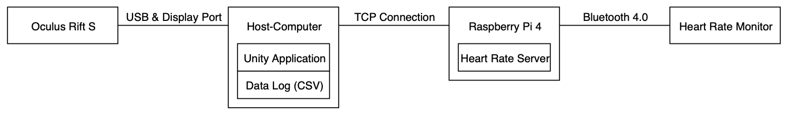

# Stress Saber

## Overview
Stress Saber is a virtual reality game for generating stress and collecting various sensor data including a heart rate measurement to study the user's stress level. The game was developed in the style of the virtual reality game [Beat Saber](https://beatsaber.com) by Beat Games.

Through constant changes in the game situation as well as changing visual and auditory effects, the user should be faced with challenges that lead to an increase in the stress level. During the game, performance and motion data of the virtual reality goggles and hand controllers as well as the player's heart rate are captured. All data is collected within the virtual reality application and made available for further evaluation.

This project was developed by Jan Knittel, Paul Knopp and Max Menne.

## Gameplay
The gameplay is based on the principle of the game Beat Saber. The Oculus Rift S headset and both controllers are needed to play. The player is in a virtual room in which cubes fly towards him. Each cube is marked with an arrow in one of the two colors, red or blue. Using the controllers, the player moves two virtual sabers, again one being red and the other blue. A cube must be smashed with the saber of the matching color in the direction of the arrow to be counted as a hit. In addition, there are also cubes marked with a white cross. If such a cube is smashed with any saber from any direction, it is counted as a miss.

## Features
- 9 different levels
- 3 levels of difficulty
- Score- and Combo-Counter
- Accuracy and heart rate monitoring in real time
- 4 spawners to generate cubes from all directions around the player
- Various game events:
  - Change of the active cube spawners
  - Rotation of the virtual room
  - Color-change of the cubes
  - Color-change of the sabers
- Random or predefined cube-pattern generation
- Variety of visual effects:
  - Fog
  - Floating elements and frames
  - Spot- and sidelights
- Several sound effects
- Different beat modes with automatic beat detection and cube generation
- Detailed data collection:
  - Performance data: Hits and misses with position, rotation, velocity and acceleration
  - Motion data: Head and hand movements of the player
  - Heart rate data: Real-time heart rate measurement of the player
- How-To-Play instructions
- Game summary with performance overview, high score table and heart rate history

## Setup
The project is composed of the following four elements: 
- [Oculus Rift S](https://www.oculus.com/rift-s/),
- host computer,
- [Raspberry Pi 4](https://www.raspberrypi.org/products/raspberry-pi-4-model-b/),
- [CooSpo heart rate monitor HW706](http://www.coospo.com/monitoring/31.html).

The following diagram illustrates the basic structure and connections of the hardware components in the project: 

To start the application:
1. connect all devices as shown above,
2. put on and activate the heart rate monitor,
3. start the Heart Rate Server by running `python heart_rate_server.py`,
4. launch the Unity application and start the game.

## Development
The following software was used to create this project:
- VR application:
  - Unity (Version 2018.4.10)
  - Unity Assets: Aura 2, TextMesh Pro, Universal Sound FX, Free Casual Game SFX, Unity Particle Pack 5.x
  - Blender (Version 2.80)
  - Microsoft Visual Studio Code (Version 1.41.1)
- Heart Rate Server:
  - Raspbian Buster
  - Hcitool & Gatttool
